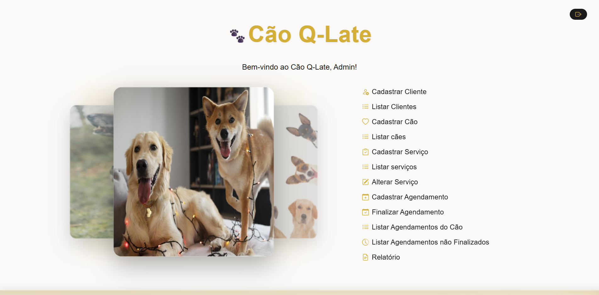

# Cão Q-Late – Sistema de Agendamento para Pet Shop  

O **Cão Q-Late** é um sistema web criado para simplificar o controle de **agendamentos e serviços** de um pet shop. Permite cadastrar, visualizar e cancelar atendimentos, respeitando regras de negócio como o prazo mínimo de 24h para cancelamentos.

O foco é a **organização e praticidade**, com uma interface limpa, intuitiva e poucos clicks, e um backend sólido feito em **Java**.

  

## Funcionalidades Principais

O sistema é voltado para uso interno do pet shop, permitindo que o administrador tenha acesso a:

**Autenticação de Administrador**  
- Login seguro (senha armazenada via hash)
- Sessão autenticada com tempo de expiração configurável
- Filtro AuthFilter protege todas as rotas

**Cadastros e Controle de Dados**  
- Cadastro de novos clientes e serviços
- Associação de múltiplos cães por CPF
  
**Gerenciamento de Agendamentos**  
- Cadastro de serviços agendados
- Cancelamento permitido apenas até 24h antes da data marcada
- Exibição de agendamentos pendentes e finalizados
  
**Listagem Inteligente**  
- Listagem de lientes, cães e serviços agrupados por agendamento 
- Listagem persoanlizada de agendamentos
- Ícone de cancelamento com checagem automática  

**Relatórios e Listagens**
- Tabela dinâmica de agendamentos não finalizados
- Exibição de serviços e valores concluídos por cão

**Interface Amigável**  
- Estilo moderno com **CSS personalizado**  
- Paleta em **dourado escuro + branco**  
- Ícones do **Bootstrap Icons**

## Tecnologias Principais e Requisitos:
- Dynamic Web Project (Maven)
- Arquitetura	MVC (Model–View–Controller)
- Java 22
- Apache Tomcat 10.1 (Jakarta EE 10)
- JSP + JSTL (Jakarta 3.0.1)
- PostgreSQL 17 (gerenciado pelo pgAdmin)
- HTML5 / CSS3 / JS / JSTL  
- Bootstrap 

## Configuração do Ambiente

### Banco de Dados
- Abra o pgAdmin
- Crie um banco chamado caoqlate
- Restaure o backup completo (caoqlate.backup) disponível na pasta database/
*Edite ConnectionFactory se necessário*

### Configuração no Eclipse

- Importe o projeto como Maven Project
- Configure o Tomcat 10.1 no Eclipse
- Adicione o projeto ao servidor
- Inicie o servidor
- Acesse no navegador: http://localhost:8080/CaoQLate/

Faça login com o administrador cadastrado e explore as funcionalidades

## Login do Funcionário (Administrador)
O login do funcionário (administrador) no sistema é realizado por meio do login e da senha. Há apenas um funcionário com permissão de acesso, que é inserido automaticamente no banco de dados durante a inicialização do sistema.

| **Login**        | **Senha** |
|------------------|-----------|
| admin@gmail      | 3333      |
